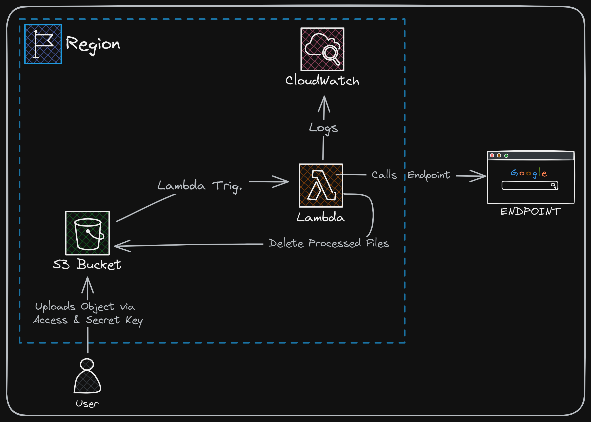

<!DOCTYPE html>
<html lang="en">
<head>
    <meta charset="UTF-8">
    <meta name="viewport" content="width=device-width, initial-scale=1.0">
    <title>Event-Driven Serverless Processing with AWS</title>
</head>
<body>
    <h1>Event-Driven Serverless Processing with AWS</h1>
    
This project demonstrates an event-driven serverless architecture using AWS services. It automates the processing of files uploaded to an S3 bucket by triggering Lambda functions that perform specified tasks, such as making API calls and deleting the uploaded files.

    <h2>Project Overview</h2>
    
The project is basically a POC project, which is essentially a sub-section of the bigger project.

    
This project includes the following components:

    <ul>
        <li><strong>AWS S3</strong>: Stores the files and triggers events upon object creation.</li>
        <li><strong>AWS Lambda</strong>: Processes the S3 events, calls external APIs, waits for a defined period, and deletes the processed files.</li>
        <li><strong>IAM Roles and Policies</strong>: Securely manage access permissions for Lambda and S3.</li>
        <li><strong>Terraform</strong>: Provisions and manages AWS resources as Infrastructure as Code (IaC).</li>
    </ul>

    <h2>Architecture Diagram</h2>
    

    <h2>Features</h2>
    <ul>
        <li><strong>Event-Driven Architecture</strong>: Automatically triggers Lambda functions when files are uploaded to S3.</li>
        <li><strong>Serverless Processing</strong>: Uses AWS Lambda for serverless function execution, ensuring scalability and cost-efficiency.</li>
        <li><strong>Automated Workflows</strong>: Performs API calls and cleans up S3 objects after processing.</li>
        <li><strong>Secure IAM Policies</strong>: Ensures secure access to AWS resources.</li>
        <li><strong>Infrastructure as Code</strong>: Utilizes Terraform for consistent and repeatable infrastructure setup.</li>
    </ul>

    <h2>Prerequisites</h2>
    <ul>
        <li>AWS Account</li>
        <li>Terraform installed</li>
        <li>AWS CLI configured</li>
    </ul>

    <h2>Pre-packaged Lambda Function</h2>
    
The <code>lambda_function.zip</code> file is included in the <code>dist/</code> directory for convenience. You can use this pre-packaged Lambda function directly or install the necessary libraries to create your own package.

    <h2>Note:</h2>
    
Please feel free to give me suggestions as I am in my learning phase. Thank you.

</body>
</html>
